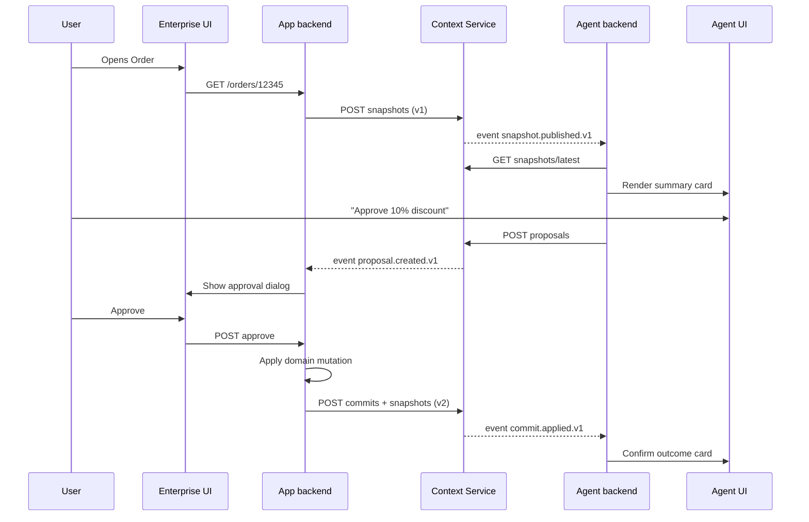

# Shared Context Service Architecture

A backend-centric design for interchange between traditional enterprise web applications and embedded AI agents.

## Problem statement

Enterprise applications built on modern web stacks (React, Vue, Angular, Web Components, or server-rendered hybrids) need a way for an embedded AI agent to share the same situational awareness as the application itself — not as an isolated chat window, but as a peer that reads and writes through a governed backend layer.

The innovation is not a UI widget. It is a **vendor-neutral Context Service** that both the traditional app backend and the AI agent backend bind to, so they interchange information through one canonical, auditable store.

## Design principles

1. **Backend-first** — Context is authored, versioned, and enforced on the server. Frontends are thin subscribers and publishers.
2. **Framework-agnostic** — Any web frontend or agent runtime can integrate via HTTP/gRPC/WebSocket and typed schemas.
3. **Proposal/commit split** — Agents propose changes; the app backend (or an approval gate) commits them. Agents never mutate authoritative records directly.
4. **Governed by default** — RBAC, tenancy, field-level policy, and provenance are properties of the Context Service, not optional LLM prompts.
5. **Patent-safe shape** — Avoid voice-first view scraping, composite-window resource buses, and CRM bot channel-mapping stores (see Prior art boundary below).

---

## System architecture

```text

 Architecture (backend-centric, framework-agnostic)

                                           ┌ Any web frontend ─────────────────────────────────────┐
                                           │┌────────────────────────┐   ┌────────────────────────┐│
                                           ││ Enterprise UI (React / │   │ Embedded agent surface ││
                                           ││  Vue / Angular / Web   │   │  (panel, cards, chat)  │├──────────────────────────────────────────┐
                                           ││      Components)       │   └────────────────────────┘│                                          │
                                           │└────────────────────────┘                             │                                          │
                                           └───────────────────────────┬───────────────────────────┘                                          │
                                                                       │                                                                      │
                                                                       ▼                                                                      │
                                             ┌ Traditional app backend ─────────────────────────┐                                             │
                                             │ ┌─────────────────────────┐  ┌──────────────────┐│                                             │
                                             │ │ Domain APIs & workflows │  │ Context Consumer ││                                             │
                                             │ └────────────┬────────────┘  └──────────────────┘│                                             │
                                             │              │                                   │                                             │
                                             │              ▼                                   │◄────────────────────────────────────────────┼┐
                                             │    ┌───────────────────┐                         │                                             ││
                                             │    │ Context Publisher │                         │                                             ││
                                             │    └───────────────────┘                         │                                             ││
                                             └─────────────────────────┬────────────────────────┘                                             ││
                                                                       │                                                                      ││
                                                                       ▼                                                                      ││
 ┌ Shared Context Layer — YOUR CORE ────────────────────────────────────────────────────────────────────────────────────────────────────────┐ ││
 │                                                               ┌─────────────────┐                                                        │ ││
 │                                                               │ Context Service │                                                        │ ││
 │                                                               └────────┬┬───────┘                                                        │ ││
 │              ┌──────────────────────────────┬──────────────────────────┴┼──────────────────────────┬──────────────────────────┐          │ ││
 │              ▼                              ▼                           ▼                          ▼                          ▼          ├◄┼┼┐
 │┌──────────────────────────┐   ┌──────────────────────────┐   ┌────────────────────┐   ┌────────────────────────┐    ┌───────────────────┐│ │││
 ││ Context Store (versioned │   │ Context Schema Registry  │   │  RBAC / tenancy /  │   │ Provenance & audit log │    │ Context Event Bus ││ │││
 ││   snapshots + deltas)    │   │ (typed entities, scopes) │   │ field-level policy │   └────────────────────────┘    │     (pub/sub)     ││ │││
 │└──────────────────────────┘   └──────────────────────────┘   └────────────────────┘                                 └───────────────────┘│ │││
 └─────────────────────────────────────────────────────────────────────┬────────────────────────────────────────────────────────────────────┘ │││
                                                                       │                                                                      │││
                                                                       ▼                                                                      │││
                                   ┌ AI agent backend ────────────────────────────────────────────────────┐                                   │││
                                   │                       ┌─────────────────┐       ┌───────────────┐    │                                   │││
                                   │                       │ Agent runtime / │       │ Approval gate │    │                                   │││
                                   │                       │  orchestrator   │       └───────┬───────┘    │                                   │││
                                   │                       └───────┬┬────────┘               │            │                                   │││
                                   │         ┌─────────────────────┼┴────────────────────────┤            │                                   │││
                                   │         ▼                     ▼                         ▼            ├◄──────────────────────────────────┴┴┘
                                   │┌────────────────┐   ┌──────────────────┐    ┌───────────────────────┐│
                                   ││ Context Reader │   │  Context Writer  │    │ Tool executor (MCP or ││
                                   │└────────────────┘   │ (proposals only) │    │        native)        ││
                                   │                     └──────────────────┘    └───────────────────────┘│
                                   └──────────────────────────────────────────────────────────────────────┘
```

### Typical flow

 1. User opens Order #12345 → app backend publishes ContextSnapshot { subject: order/12345, fields, user, tenant, intent }.
 2. Agent backend subscribes → sees the same snapshot the app backend authored.
 3. Agent proposes ActionProposal { type: update_field, diff, rationale } → writes to context as proposal, not direct mutation.
 4. User approves → app backend (or gated executor) applies the change → new snapshot version published → both sides stay in sync.

---

### Layer responsibilities

| Layer | Role | Owns |
|-------|------|------|
| Presentation | Renders UI and agent surface | View state, user gestures, display of proposals |
| App backend | Business logic and authoritative data | Domain mutations, workflow rules, commit authority |
| Context Service | Canonical interchange | Snapshots, proposals, schema, policy, audit |
| Agent backend | Reasoning and tool use | Plans, proposals, structured cards — not direct writes |

---

## Core data model

### ContextSession

A durable scope that ties together one user task across page navigations and agent turns.

```json
{
  "contextId": "ctx_01HXYZ...",
  "tenantId": "tenant_acme",
  "subject": {
    "entityType": "order",
    "entityId": "12345"
  },
  "actor": {
    "userId": "user_42",
    "roles": ["sales_rep"]
  },
  "intent": "review_and_approve_discount",
  "createdAt": "2026-08-23T04:00:00Z",
  "version": 7
}
```

### ContextSnapshot

An immutable, versioned view of what both backends agree the agent and app can see.

```json
{
  "contextId": "ctx_01HXYZ...",
  "version": 7,
  "snapshotId": "snap_7",
  "publishedBy": "app-backend",
  "publishedAt": "2026-08-23T04:01:12Z",
  "payload": {
    "entityType": "order",
    "entityId": "12345",
    "fields": {
      "status": "pending_approval",
      "total": 12500.00,
      "discountRequested": 0.15
    },
    "uiHints": {
      "route": "/orders/12345",
      "activePanel": "pricing"
    }
  },
  "policy": {
    "readableFields": ["status", "total", "discountRequested"],
    "writableFields": []
  },
  "provenance": {
    "source": "order-service",
    "correlationId": "req_abc"
  }
}
```

### ActionProposal

Agent output that requests a change but does not apply it.

```json
{
  "proposalId": "prop_9f3a",
  "contextId": "ctx_01HXYZ...",
  "basedOnSnapshotId": "snap_7",
  "proposedBy": "agent-backend",
  "proposedAt": "2026-08-23T04:01:45Z",
  "type": "field_update",
  "target": {
    "entityType": "order",
    "entityId": "12345"
  },
  "diff": {
    "discountApproved": 0.10
  },
  "rationale": "Customer tier qualifies for 10%; requested 15% exceeds policy.",
  "requiresApproval": true,
  "status": "pending"
}
```

### ContextCommit

The app backend (or gated executor) records what was actually applied.

```json
{
  "commitId": "cmt_2b1c",
  "contextId": "ctx_01HXYZ...",
  "proposalId": "prop_9f3a",
  "committedBy": "app-backend",
  "committedAt": "2026-08-23T04:02:30Z",
  "approvedBy": "user_42",
  "resultSnapshotId": "snap_8",
  "outcome": "applied"
}
```

---

## Context Service API surface

REST-style paths shown; gRPC equivalents recommended for high-throughput backends.

### Session lifecycle

| Method | Path | Caller | Purpose |
|--------|------|--------|---------|
| `POST` | `/v1/context/sessions` | App backend | Open a context session for a subject + actor |
| `GET` | `/v1/context/sessions/{contextId}` | App or agent | Read session metadata |
| `PATCH` | `/v1/context/sessions/{contextId}` | App backend | Update intent, subject, or scope |
| `DELETE` | `/v1/context/sessions/{contextId}` | App backend | Close session (retain audit) |

### Snapshots (app-authoritative read model)

| Method | Path | Caller | Purpose |
|--------|------|--------|---------|
| `POST` | `/v1/context/sessions/{contextId}/snapshots` | App backend | Publish new snapshot (increments version) |
| `GET` | `/v1/context/sessions/{contextId}/snapshots/latest` | App or agent | Read current snapshot |
| `GET` | `/v1/context/sessions/{contextId}/snapshots/{version}` | App or agent | Read historical snapshot |
| `GET` | `/v1/context/sessions/{contextId}/snapshots` | App or agent | List snapshot history (paginated) |

### Proposals (agent write path — non-mutating)

| Method | Path | Caller | Purpose |
|--------|------|--------|---------|
| `POST` | `/v1/context/sessions/{contextId}/proposals` | Agent backend | Submit structured proposal against a snapshot |
| `GET` | `/v1/context/sessions/{contextId}/proposals` | App or agent | List proposals (filter by status) |
| `GET` | `/v1/context/sessions/{contextId}/proposals/{proposalId}` | App or agent | Read one proposal |
| `POST` | `/v1/context/sessions/{contextId}/proposals/{proposalId}/reject` | App backend | Reject with reason |

### Commits (app-authoritative mutation path)

| Method | Path | Caller | Purpose |
|--------|------|--------|---------|
| `POST` | `/v1/context/sessions/{contextId}/commits` | App backend | Apply approved proposal; publish result snapshot |
| `GET` | `/v1/context/sessions/{contextId}/commits` | App or agent | Audit trail of commits |

### Schema registry

| Method | Path | Caller | Purpose |
|--------|------|--------|---------|
| `PUT` | `/v1/schemas/{entityType}` | Platform admin | Register or update entity context schema |
| `GET` | `/v1/schemas/{entityType}` | App or agent | Resolve field types, labels, policy defaults |

### Events (pub/sub)

| Event | Publisher | Subscribers | Payload |
|-------|-----------|-------------|---------|
| `context.session.opened.v1` | Context Service | Agent runtime | `{ contextId, subject, actor }` |
| `context.snapshot.published.v1` | Context Service | Agent runtime, app consumers | `{ contextId, version, snapshotId }` |
| `context.proposal.created.v1` | Context Service | App backend, UI | `{ contextId, proposalId, type }` |
| `context.commit.applied.v1` | Context Service | Agent runtime, UI | `{ contextId, commitId, resultSnapshotId }` |

WebSocket channel: `wss://.../v1/context/sessions/{contextId}/stream` — delivers the event stream for one session.

---

## End-to-end flow



---

## Integration patterns

### For any enterprise app backend

1. On meaningful user navigation or record selection, open or update a `ContextSession`.
2. Publish a `ContextSnapshot` with typed fields the agent is allowed to see (policy-enforced).
3. Subscribe to `context.proposal.created.v1`; surface proposals in native UI or agent panel.
4. On user approval, mutate domain state through existing APIs, then `POST /commits` and publish the next snapshot.

### For any agent backend

1. Subscribe to snapshot events for active sessions (or poll `latest`).
2. Never call domain mutation APIs directly unless explicitly delegated through the approval gate.
3. Write only `ActionProposal` records; include `basedOnSnapshotId` for optimistic concurrency.
4. Re-read snapshot after commit before proposing again.

### Frontend (framework-agnostic)

Frontends do not own context truth. They:

- Call app backend APIs that publish snapshots.
- Render agent cards from agent backend responses.
- Forward user approvals to the app backend, not to the agent.

Thin SDKs (JS, Java, .NET, Python) wrap the Context Service API and schema validation.

---

## Novelty of this solution

What is **not** novel (crowded prior art):

- Embedded copilot side panel beside a form.
- Agent that "knows the current record" via CRM variables or page context.
- Chat history passed as prompt context.
- Composite desktop windows sharing context over a frontend message bus (FDC3 / OpenFin / HERE).

What **is** differentiated:

| Differentiator | Why it matters |
|----------------|----------------|
| **Dual-backend peer model** | App server and agent server are equal clients of one Context Service — not agent-as-chatbot-on-channel or client-side screen scraper. |
| **Versioned snapshot lineage** | Every agent turn is anchored to an immutable snapshot ID; proposals reference `basedOnSnapshotId` for replay, debug, and compliance. |
| **Proposal/commit separation** | Agents cannot mutate authoritative state; commits require app-backend authority or explicit human approval recorded in audit. |
| **Schema-bound context envelopes** | Context is typed (`entityType`, field policy, scopes), not opaque text stuffed into a prompt. |
| **Policy in the context layer** | RBAC and field-level read/write rules travel with the snapshot; the agent runtime does not infer permissions from the LLM. |
| **Cross-navigation session continuity** | One `contextId` survives route changes, agent handoffs, and multi-step workflows without rebuilding chat context. |
| **Event-native interchange** | Pub/sub over snapshots and proposals decouples app and agent release cycles. |

---

## Prior art boundary (design-around)

To preserve freedom to operate, implementations should **avoid**:

| Pattern | Typical patent holder | Safer alternative |
|---------|----------------------|-------------------|
| Voice utterance + user view context auto-execution | Microsoft (US11789696 family) | Text-first agent; semantic snapshots, not screen scraping |
| Context groups mapping + trans-resource messaging bus | HERE / OpenFin (US12210887) | Unified app shell; backend Context Service, not inter-window bus |
| Bot agent + channel context mapping store | Salesforce (US11087333) | Typed schema registry; in-app session, not omnichannel bot mediation |
| Auto page-switch / auto field fill without approval | Microsoft dependent claims | Structured proposals + explicit commit |

This architecture is intentionally shaped to sit in the **backend protocol + governance** white space.

---

## CopilotKit comparison

[CopilotKit](https://docs.copilotkit.ai/concepts/architecture) is the closest product match for the **UX goal** — an embedded agent panel that shares situational awareness with the enterprise UI. It solves a **different architectural problem** than this Context Service.

### CopilotKit's three-layer stack

CopilotKit connects **frontend → Copilot Runtime → agent backend** over the open [AG-UI protocol](https://docs.ag-ui.com/concepts/state) (SSE event stream):

| Layer | Role |
|-------|------|
| **Frontend** | React/Vue/Angular SDK; `useAgent`, `useAgentContext`, `CopilotSidebar` |
| **Copilot Runtime** | Request handler in your app server (Next.js, Express, Hono); auth, middleware, AG-UI proxy |
| **Agent backend** | Built-in Agent, LangGraph, Mastra, or any AG-UI-compatible agent |

There is **no separate traditional app backend peer**. Domain APIs (orders, CRM, ERP) sit beside this path — not through a governed Context Service.

### How CopilotKit shares state (two channels)

**Channel A — Shared state (bidirectional, agent-owned)**

- One JSON **agent execution state** object both UI and agent read/write.
- Frontend: `useAgent()` → `agent.state` (read), `agent.setState()` (write).
- Backend: LangGraph nodes/tools update state; wire format is AG-UI `STATE_SNAPSHOT` + `STATE_DELTA` (JSON Patch).
- **Owner of truth:** the agent backend, not the domain app backend.

**Channel B — Agent read-only context (UI → agent only)**

- Frontend: `useAgentContext({ description, value })` publishes UI-owned values (user, selected record, route).
- Runtime middleware injects these into the model message history every turn.
- Agent cannot write back. Values typically come from frontend state or fetches against your domain API.

Sources: [Shared State](https://docs.copilotkit.ai/shared-state), [Agent Read-Only Context](https://docs.copilotkit.ai/shared-state/agent-readonly), [Architecture](https://docs.copilotkit.ai/concepts/architecture)

### Side-by-side comparison

| Dimension | CopilotKit | Context Service (this design) |
|-----------|------------|-------------------------------|
| Primary problem | Connect **frontend ↔ agent** with real-time shared state | Connect **app backend ↔ agent backend** with governed interchange |
| Center of gravity | Agent execution state + UI reactivity | Canonical domain context store |
| State owner | **Agent** owns shared state | **Context Service** owns snapshots; app owns commits |
| Domain record truth | Your domain APIs (orthogonal) | App-published snapshots are the authoritative read model |
| Agent writes | Can mutate shared state; tools may hit domain APIs directly | **Proposals only**; app backend **commits** |
| UI context → agent | `useAgentContext` → prompt injection | App publishes `ContextSnapshot` → agent reads via API |
| Versioning | LangGraph checkpoints; Enterprise Intelligence thread history | Explicit `version` + `basedOnSnapshotId` stale rejection |
| RBAC / policy | Runtime auth + tool design; not embedded in state artifact | Policy **embedded in snapshot envelope** |
| Audit lineage | Thread event replay (Enterprise Intelligence) | session → snapshot → proposal → commit chain |
| Framework lock-in | React-first SDK; AG-UI wire protocol is open | HTTP/gRPC API — any frontend, any agent runtime |

### Architecture shapes compared

**CopilotKit (default integration path):**

```text
 Frontend                         Copilot Runtime              Agent backend
 ┌──────────────┐                  ┌──────────────┐            ┌──────────────┐
 │ Enterprise   │  useAgent()      │ Auth, proxy, │   AG-UI    │ LangGraph /  │
 │ UI + Panel   │◄────────────────►│ middleware   │◄──────────►│ Built-in     │
 └──────┬───────┘  AG-UI SSE       └──────────────┘            └──────────────┘
        │ fetch domain data
        ▼
 ┌──────────────┐
 │ Domain APIs  │◄── agent tools (direct API calls)
 └──────────────┘
```

**Context Service (this design):**

```text
 Enterprise UI (any web)                    Agent panel (any web)
        │                                           │
        ▼                                           ▼
 App backend ◄────────► Context Service ◄────────► Agent backend
 (publish snapshots,   (snapshots, proposals,     (read snapshots,
  commit mutations)      audit, RBAC)              write proposals)
```

**Core difference:** CopilotKit syncs **agent state to UI**. Context Service syncs **domain context between two backends** with governance in the middle.

### What CopilotKit covers vs gaps

| Goal | CopilotKit | Gap for enterprise backend governance |
|------|------------|---------------------------------------|
| Agent panel beside enterprise UI | Yes | — |
| Agent sees what user is viewing | Yes (`useAgentContext`) | Injected into prompt, not versioned snapshot API |
| Real-time UI updates as agent works | Yes (`STATE_DELTA` streaming) | Agent-owned state, not domain authority |
| Agent proposes, human approves | Partial (tool-level HITL) | No snapshot-anchored proposal/commit |
| App backend and agent as equal peers | No | Runtime brokers frontend↔agent only |
| Authoritative domain record via context layer | No | Tools/APIs wired ad hoc |

### Hybrid integration (recommended if adopting CopilotKit for UI)

Use CopilotKit for **presentation transport**; use Context Service for **domain authority**:

| Layer | Technology | Responsibility |
|-------|------------|----------------|
| Frontend transport | CopilotKit + AG-UI | Panel, streaming, `useAgentContext` for lightweight UI hints |
| Backend truth | Context Service | Snapshots, proposals, commits, RBAC, audit |
| Agent tools | MCP | `getContextSnapshot()`, `submitProposal()` against Context Service |
| App backend | Your domain APIs | Publish snapshots on navigation; commit on user approval |

CopilotKit handles **presentation sync**; Context Service handles **enterprise semantics**. This avoids reimplementing AG-UI SSE/state-delta while preserving differentiated backend IP.

### Strategic takeaway

| Question | Answer |
|----------|--------|
| Is CopilotKit close in UX? | **Yes** — shared state, embedded panel, UI-aware agent |
| Is it the same architecture? | **No** — agent-centric state sync, not dual-backend governed interchange |
| Overlap estimate | ~60% of surface experience; ~20% of backend governance model |
| Build vs compose | **Compose:** CopilotKit/AG-UI for wire-up + Context Service for enterprise backend semantics |

---

## Patent angles (drafting directions — not legal advice)

Consult patent counsel before filing. The following are **technical angles** where specification and claims may be strongest, based on differentiation from known filings:

### Angle 1 — Dual-backend context interchange protocol

**Claim shape:** A method where a traditional application backend and an AI agent backend both connect to a shared context service; the app backend publishes versioned snapshots; the agent backend reads snapshots and writes non-authoritative proposals; only the app backend (or a policy-gated executor) commits mutations.

**Emphasis:** Peer backends, not client-side copilot or chatbot-on-channel.

### Angle 2 — Snapshot-anchored proposal with optimistic concurrency

**Claim shape:** Agent proposals must reference a specific snapshot version; the context service rejects proposals whose `basedOnSnapshotId` is stale relative to the latest committed snapshot; upon commit, a new snapshot version is atomically published.

**Emphasis:** Concurrency, auditability, and safe multi-turn agent loops in enterprise workflows.

### Angle 3 — Policy-carrying context envelope

**Claim shape:** Each snapshot embeds field-level read/write policy derived from RBAC and entity schema; the context service enforces policy on agent read and proposal write paths before data reaches the agent runtime.

**Emphasis:** Governance as part of the context artifact, not post-hoc LLM filtering.

### Angle 4 — Proposal/commit audit chain with provenance

**Claim shape:** A linear or DAG-structured provenance log linking sessions, snapshots, proposals, approvals, and commits, enabling replay of agent-assisted decisions for regulated industries.

**Emphasis:** Compliance and explainability — underserved in frontend copilot patents.

### Angle 5 — Cross-application context session federation (optional extension)

**Claim shape:** Multiple app backends (e.g., CRM + billing) contribute snapshots into one federated session subject, with schema registry resolving entity relationships and the agent reasoning across bounded snapshots.

**Emphasis:** Enterprise integration without cloning a single vendor's data cloud.

### Angle 6 — Event-driven decoupling of app and agent lifecycles

**Claim shape:** Context service emits typed events on snapshot publish and proposal create; agent runtime subscribes without synchronous coupling to app request/response paths.

**Emphasis:** Operational independence for microservice and multi-team deployments.

### What to avoid claiming (likely crowded)

- Generic "AI assistant in a sidebar."
- "Agent reads current page" without the backend snapshot/proposal/commit structure.
- Voice + multimodal input arbitration.
- Composite UI window layout with dynamic resource sharing sets.

---

## Recommended next steps

1. **Implement Context Service MVP** — sessions, snapshots, proposals, commits, events.
2. **Publish JSON Schema** for `ContextSnapshot`, `ActionProposal`, and `ContextCommit`.
3. **Reference integration** — one sample app backend (any stack) + one agent backend using MCP tools for domain actions.
4. **Prior art search** — formal FTO claim chart on US11789696, US11087333, and US12210887 against this spec before public launch or fundraising.
5. **Provisional filing** — if counsel agrees, file on dual-backend interchange + snapshot-anchored proposals + policy-carrying envelopes.

---

## Related documents

- Scout report: `data/scout-gen-ui-research/report.md` (firstmate home, patent landscape)
- Project README: `../README.md`

---

*Document version: 1.1 — 2026-08-23 (added CopilotKit comparison)*
